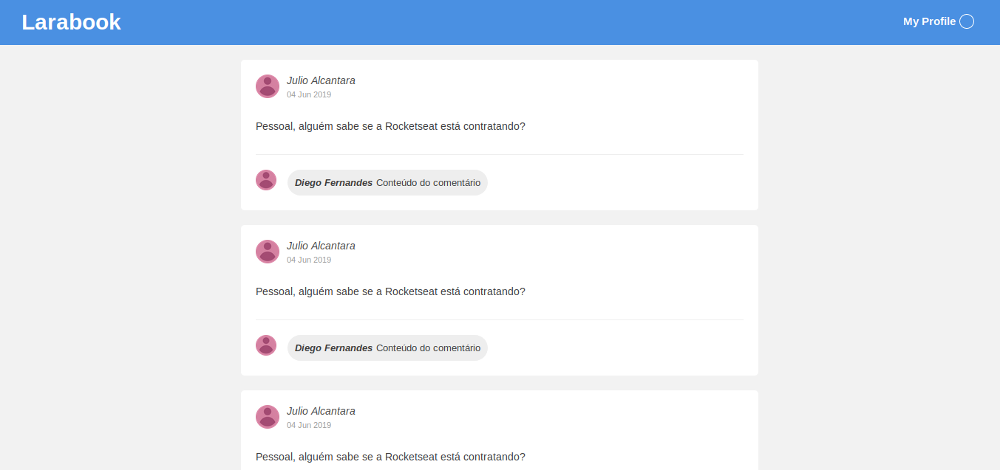

# Social network sample interface

<p align="center">
  
</p>

[Rocketseat's GoStack bootcamp](https://rocketseat.com.br/bootcamp) 4th challenge in learning React.

# About

A ReactJS app that uses components to better organize a social network listing of posts.

It organizes each element in the following components:

- App
  - Header
  - PostList
    - Post
      - Comment

It has `Backpack` and `Babel` configured.

# Set up

1. Clone the repository
```sh
git clone git@github.com:Artenes/rocketseat-bootcamp-challenge04.git
cd rocketseat-bootcamp-challenge04
```

2. Install dependencies
```sh
yarn
```

3. Run the app
```sh
yarn dev
```

4. Access [http://localhost:8080](http://localhost:8080).

# Contact

Artenes Nogueira - [artenes.nogueira@gmail.com](mailto:artenes.nogueira@gmail.com)

Linkedin - [linkedin.com/in/artenes/](https://www.linkedin.com/in/artenes/)

Blog - [artenesbok.com/](http://artenesbok.com/)